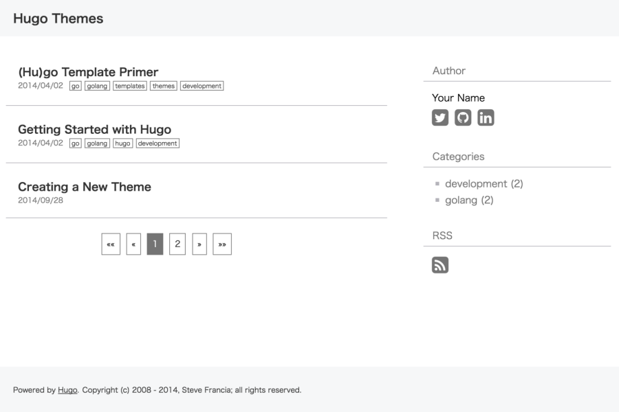

Geppaku
=============================
Geppaku is bluish white theme for [Hugo](http://gohugo.io/).

## Screenshot
### Index page


### Post page


## Installation

```
$ mkdir themes
$ cd themes
$ git clone https://github.com/masa0221/hugo-theme-geppaku geppaku
```
See the Hugo documentation for more information.


## Config

Example of config.toml file:
```toml
baseurl = "http://your-site-here/"
languageCode = "en-us"
title = "your site title"
theme= "geppaku"
googleAnalytics = ""

[author]
    # If you want to display author information set these
    # This is Optional values
    name = "Your name"

    # Please set account ids
    # This is Optional values
    twitter  = "your twitter id"
    linkedin = "your linkedin id"
    github   = "your github id"

[params]
    # Please set id when you want to add to feature for comment
    # @see https://disqus.com
    # This is Optional values
    disqus = "your disqus shortname"

    [params.sharebutton]
        # If you want to display share buttons set these
        # This is Optional values
        twitter  = true
        facebook = true
        # hatena   = true # hatena is Japanese social media
        google   = true
        pocket   = true
        # Please set id when you want to display facebook
        facebookAppId = "your app id"

    [params.adsense]
        # If you want to display Google adsense set these
        # This is Optional values
        # 1. Create file written of the adsense tag into the directory "layout/partials"
        # 2. Please set file path name omitted "layout"
        sidebar = "adsense/sidebar.html"
        content = "adsense/content.html"
```
You can delete optional parameter.  
Please delete unnecessary parameter.

### Post

Create markdown file:
```sh
hugo new post/2016/05/hello-hugo.md
```

Example of the markdown file:
```md
+++
date = "2016-04-30T16:44:45+09:00"
draft = false
title = "Hello Hugo!"
slug = "hello-hugo"
categories = ["tech"]
tags = [
  "hugo",
  "golang",
  ]
+++
Hello Hugo!
```

